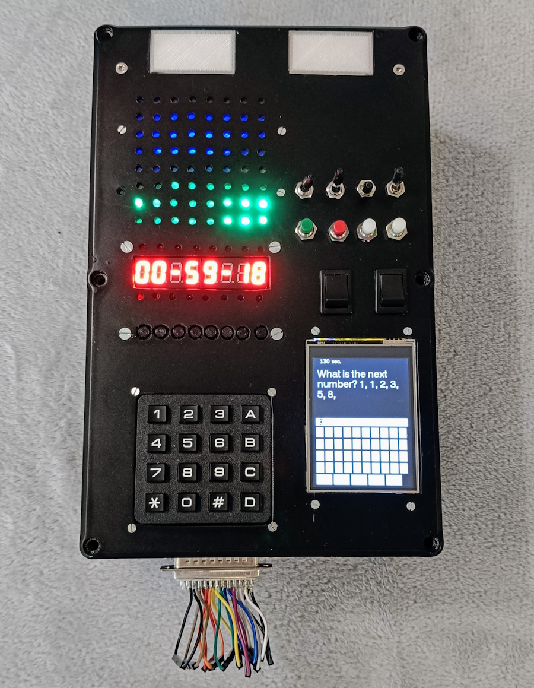

# NotABomb - Portable Escape Room Challenge

NotABomb is an interactive portable escape room challenge where participants must "diffuse" a device by solving various puzzles and challenges. The project combines hardware interaction with digital puzzles, creating an engaging and immersive experience.

## Overview

The system consists of a box equipped with various interactive elements:
- Buttons for user input
- LED indicators
- ESP32 display (CYD - Cheap Yellow Display) with touch screen capabilities
- Sound output
- SD Card support for data storage

The main display shows different challenges that participants must solve. These challenges are loaded as JSON files from a web server, allowing for easy content updates and modifications.

## Hardware Components

The project utilizes two ESP32 microcontrollers:
1. **Main Display Unit (CYD - Cheap Yellow Display)**
   - Touch screen interface
   - Audio output
   - SD Card reader
   - Displays challenges and game status

2. **Control Unit (ESP32)**
   - Manages physical inputs (buttons)
   - Controls LED outputs
   - Handles game logic and input processing

## Code Structure

The project is built using PlatformIO and is organized into several key components:

### Core Components
- `src/main.cpp`: Main program entry point and control flow
- `src/connection.cpp`: Handles communication between components
- `src/KeyBox.cpp` & `src/KeypadBox.cpp`: Button input processing
- `src/LEDMatrix.cpp`: LED matrix display control
- `src/TM1638Box.cpp`: Additional I/O handling through TM1638 module

### Headers
- `include/connection.h`: Communication protocols and definitions
- `include/KeyBox.h` & `include/KeypadBox.h`: Input handling interfaces
- `include/LedChain.h` & `include/LEDMatrix.h`: LED control interfaces
- `include/TM1638Box.h`: Interface for TM1638 module (buttons/LED module)

## Game System

The game operates as a portable escape room challenge:
1. Challenges are loaded from a web server as JSON files
2. The CYD display shows the current challenge to players
3. Players interact with physical buttons and observe LED feedback
4. Multiple challenge types can be implemented through the JSON format
5. Progress is tracked and displayed on the CYD screen

## Setup and Development

### Prerequisites
- PlatformIO IDE
- ESP32 development boards
   - 1x ESP32 with CYD display
   - 1x Standard ESP32
- Hardware components:
   - LED strips/matrix
   - Buttons
   - TM1638 module
   - Enclosure/box

### Building and Flashing
1. Clone the repository
2. Open the project in PlatformIO
3. Install required dependencies
4. Build and upload to both ESP32 devices:
   - Main program to the control ESP32
   - Display program to the CYD ESP32 (separate repository)

## Images

## Contributing

Contributions to improve the project are welcome:
- Creating new challenges (JSON format)
- Code improvements
- Hardware modifications
- Bug reports and fixes

## License

This project is open source and available under the MIT License.
